# 💎 Awesome Gemini Visual Gems

[](https://opensource.org/licenses/MIT)
[](https://gemini.google.com)
[](prompts/)
[](README_cn.md)

> **14 Battle-Tested Visual Designer Prompts for Google Gemini** — Transform any text into scroll-stopping infographics with surgical precision.

---

## What is This?

**Gemini Gems** are custom instructions that transform Google Gemini into a specialized expert. This repository provides **14 professionally engineered Gem instructions** designed to convert any text into viral-ready visual infographics.

These prompts are specifically optimized for Gemini models with strong **text-rendering** and **prompt-adherence** capabilities (like the latest iterations). Each prompt follows a rigorous V2.1 template structure that ensures:

- **Aspect Ratio Intelligence** — Automatic layout adaptation for covers (16:9), inline images (4:3/1:1), and posters (3:4)
- **Text Deconstruction Protocol** — Extracts main titles and condenses content into visual-friendly phrases
- **Style-Specific Design Rules** — Enforced color constraints, texture requirements, and aesthetic non-negotiables
- **High-Fidelity Text Rendering** — Crystal-clear typography that actually works in AI-generated images

---

## 💡 Why This Matters

**The Problem:** Default AI image generators struggle with text rendering, ignore layout constraints, and produce inconsistent, generic styles.

**The Solution:** By combining Google Gemini's advanced text-rendering capabilities with our surgical prompt architecture, these Gems act as a translation layer. They turn your casual text into rigid, highly constrained prompt formulas that force the AI to produce perfect typography and pixel-perfect aesthetics.

---

## Repository Structure

```text
📦 Awesome-Gemini-Visual-Gems
 ┣ 📂 prompts/           # 14 Gem instruction files (.md)
 ┣ 📂 assets/            # Demo images & QR code
 ┣ 📜 README.md          # English documentation
 ┗ 📜 README_cn.md       # 中文说明文档
```

---

## How to Use

### Step 1: Open Gemini
Navigate to [Google Gemini](https://gemini.google.com) and sign in.

### Step 2: Create a Gem
1. Click **"Gems"** in the sidebar
2. Click **"Create new Gem"**
3. Name it (e.g., `"Marker Sketchnote Expert"`)

### Step 3: Inject the Prompt
1. Open the `.md` file for your chosen style from the `prompts/` folder
2. **Copy the ENTIRE content** (select all, copy)
3. Paste into the **"Instructions"** field
4. Save the Gem

### Step 4: Generate
Chat with your new Gem. Send any text content, specify your preferred aspect ratio, and watch the magic happen.

---

## Quick Example

**🧑‍💻 User Input:**
> "Explain First Principles thinking."

**💎 Gem Processing:**
*Deconstructs concept ➔ Extracts title "First Principles" ➔ Matches metaphors (lightbulbs, building blocks) ➔ Generates the precise rendering formula.*

**✨ Final Prompt Sent to Image Model:**
> *"A highly detailed digital illustration of a vintage chalkboard infographic, academic blackboard art style. Dark dusty slate green background... High-fidelity chalk lettering reading exactly 'First Principles Thinking'..."*

*👇 See the Chalkboard Academic demo below for the actual output!*

---

## The 14 Visual Styles

| Style (Gem Name) | Best For (Use Case) | Demo |
|:--|:--|:--:|
| 🖍️ [**01. Marker Sketchnote**](prompts/01_Marker_Sketchnote.md) | Knowledge breakdowns, reading notes, accessible tech explainers | 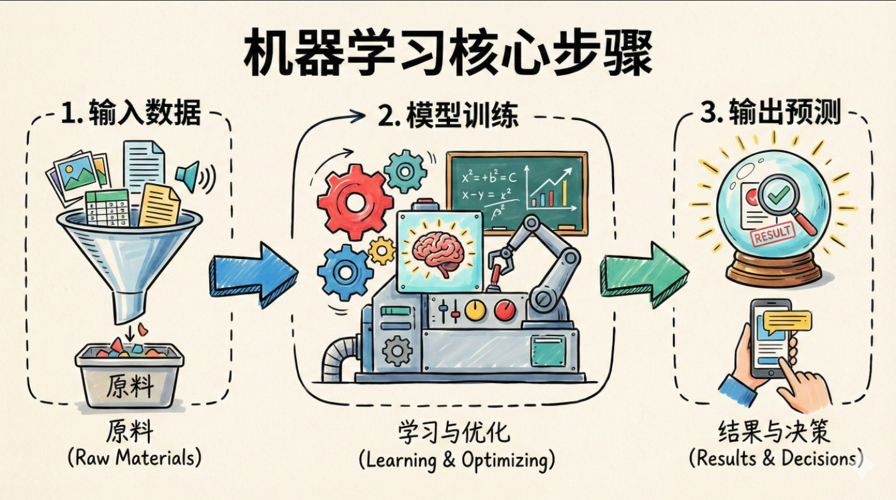 |
| 🧮 [**02. Chalkboard Academic**](prompts/02_Chalkboard_Academic.md) | Hardcore foundational logic, STEM education, academic tutorials | 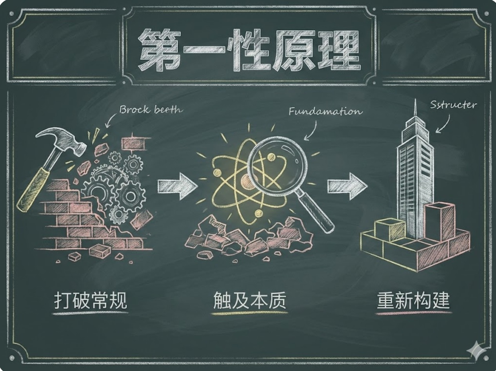 |
| 🧍‍♂️ [**03. Minimalist Stick Figure**](prompts/03_Minimalist_Stick_Figure.md) | Workplace satire, philosophical reflections, humorous observations | 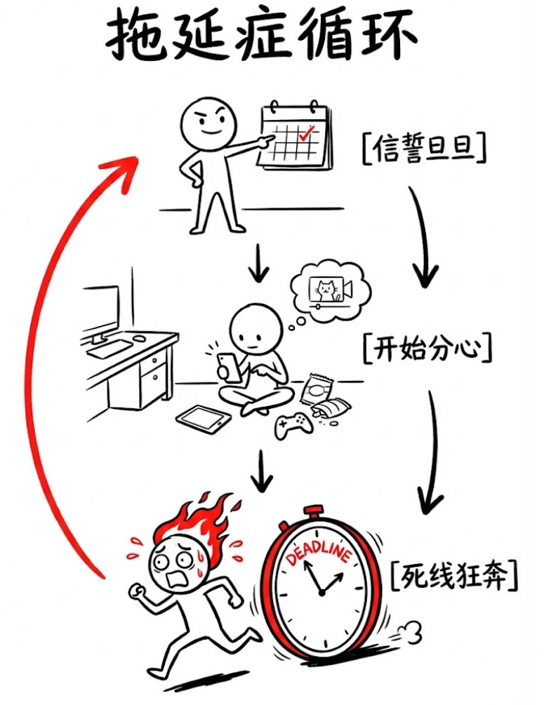 |
| 🏢 [**04. Flat Vector**](prompts/04_Flat_Vector.md) | B2B services, SaaS features, tech jargon visualizations | 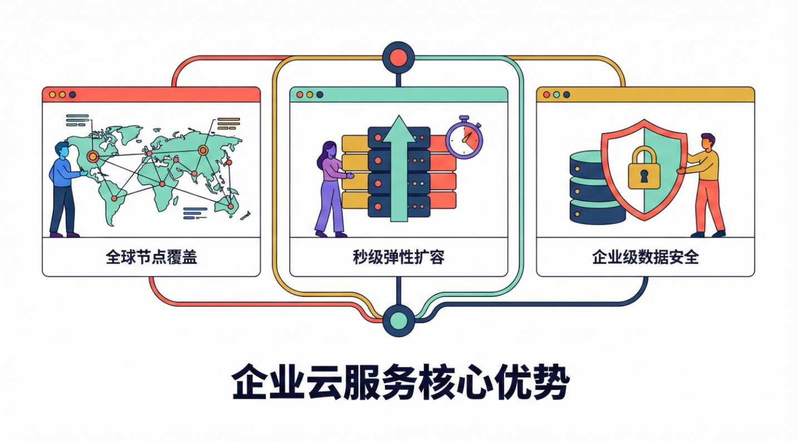 |
| 🍱 [**05. Bento Box UI**](prompts/05_Bento_Box_UI.md) | Consumer electronics specs, product launch highlights | 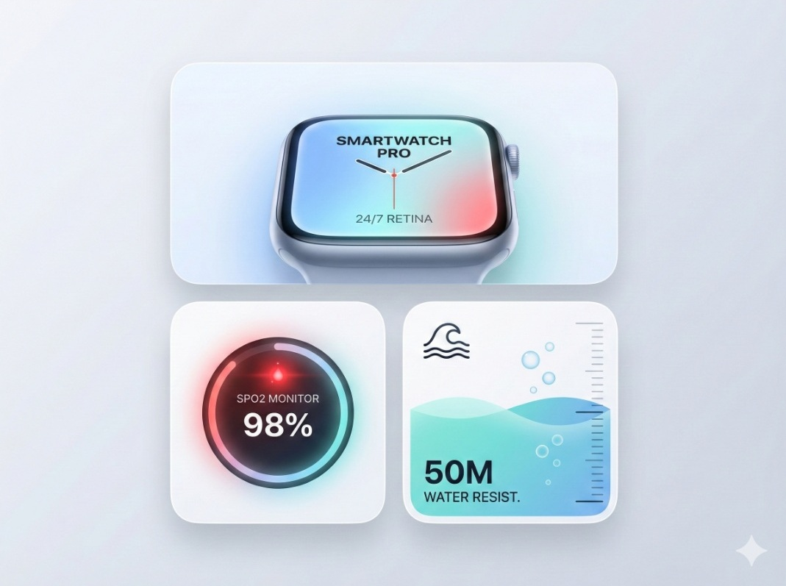 |
| 🔮 [**06. Glassmorphism & Abstract 3D**](prompts/06_Glassmorphism_Abstract.md) | AI/LLM concepts, Web3 trends, futuristic UI | 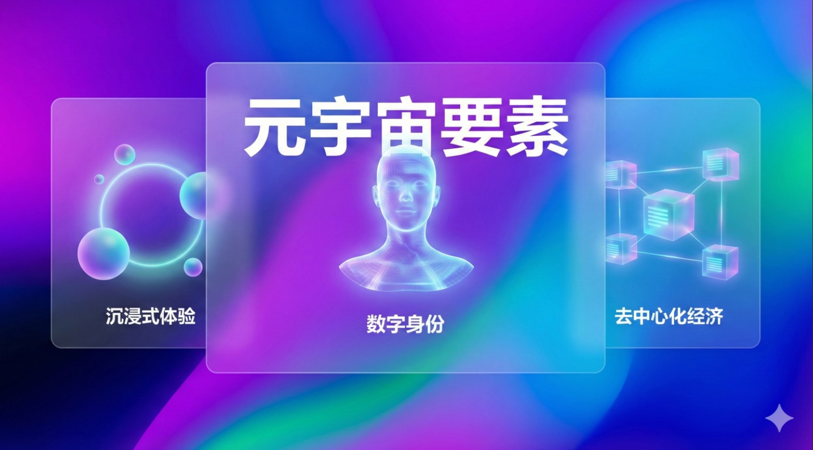 |
| 🏗️ [**07. Isometric 3D**](prompts/07_Isometric_3D.md) | System architecture, cloud infrastructure, supply chains | 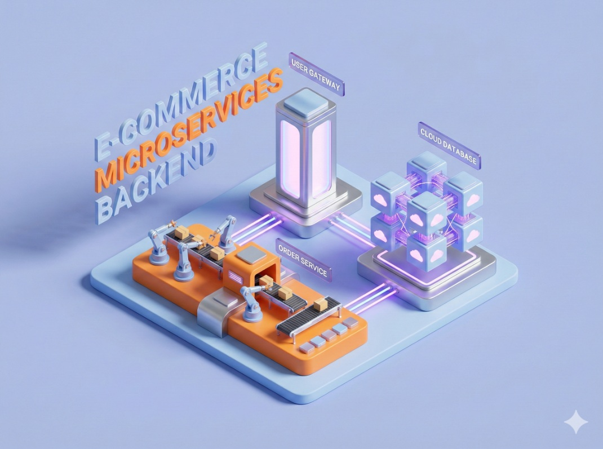 |
| 📐 [**08. Tech Blueprint**](prompts/08_Tech_Blueprint.md) | Hardware teardowns, mechanical analysis, industrial manufacturing | 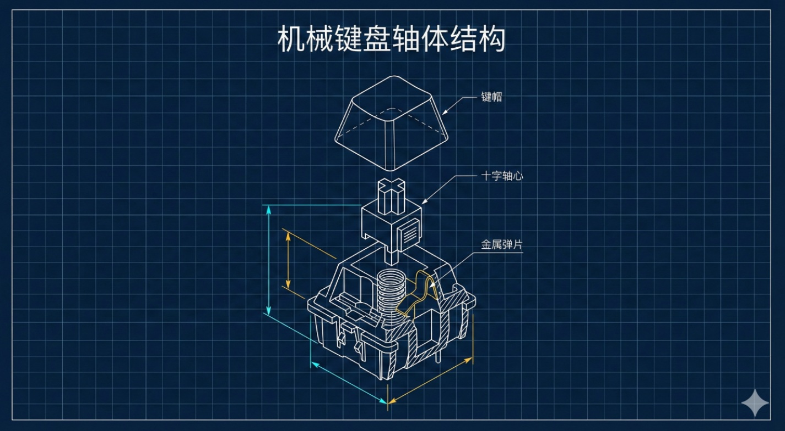 |
| 📟 [**09. Cyberpunk Dashboard**](prompts/09_Cyberpunk_Dashboard.md) | Cybersecurity reports, hacking techniques, dark web data viz | 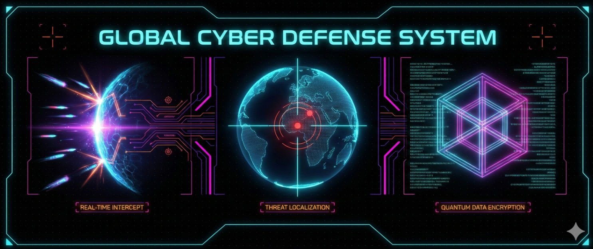 |
| 🧸 [**10. 3D Claymorphism**](prompts/10_3D_Claymorphism.md) | Psychology content, community guidelines, user growth | 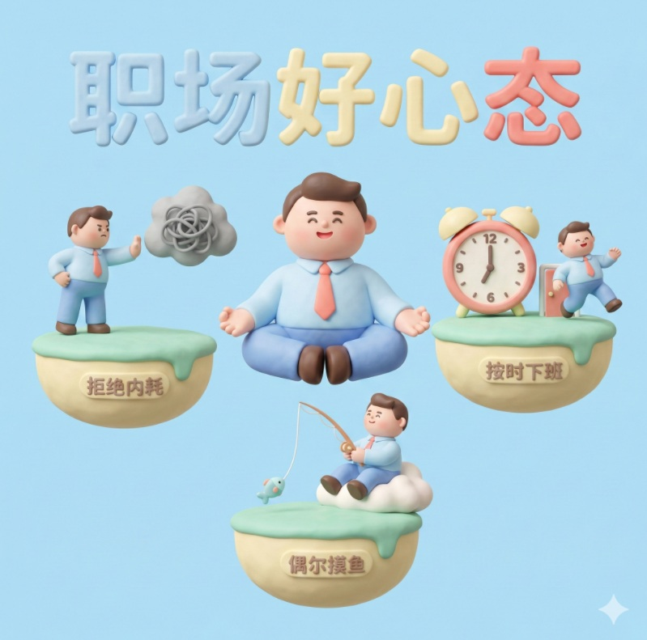 |
| 👾 [**11. Pixel & Voxel Art**](prompts/11_Pixel_Voxel_Art.md) | Developer humor, retro gaming, geek milestones | 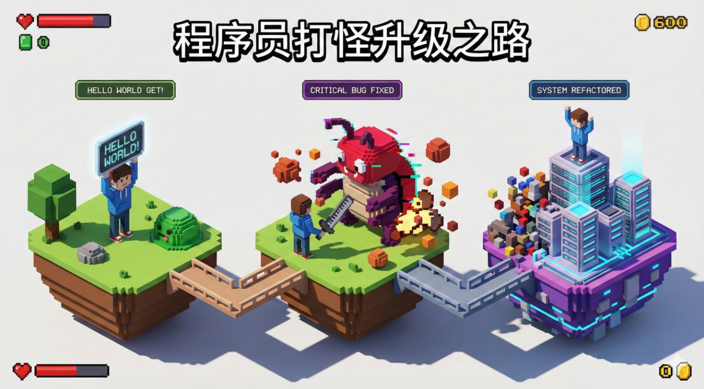 |
| ⬛ [**12. Neo-Brutalism**](prompts/12_Neo_Brutalism.md) | Bold opinions, unconventional design, trend forecasting | 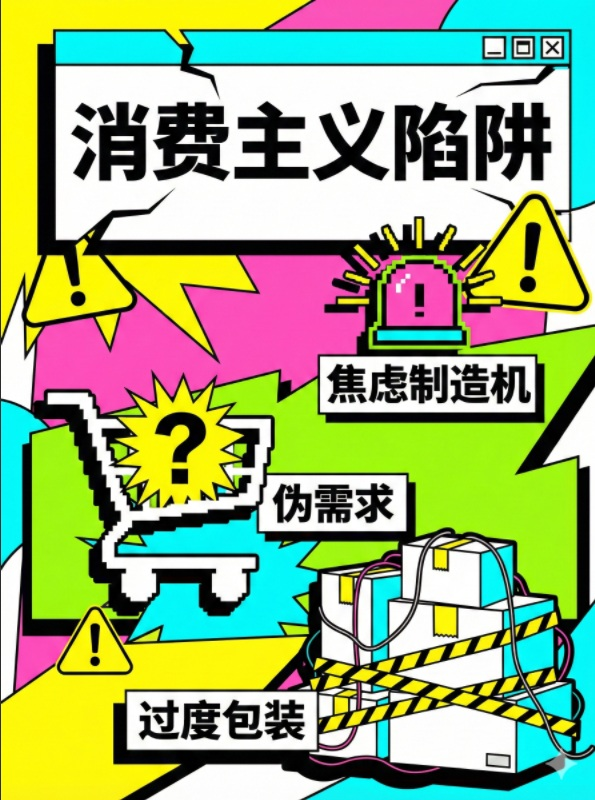 |
| 💥 [**13. Retro Pop Art**](prompts/13_Retro_Pop_Art.md) | Traditional vs. modern conflicts, dramatic pain points |  |
| 💿 [**14. Acid Graphics & Y2K**](prompts/14_Acid_Graphics_Y2K.md) | Underground electronic music, digital nomad lifestyle, art exhibitions | 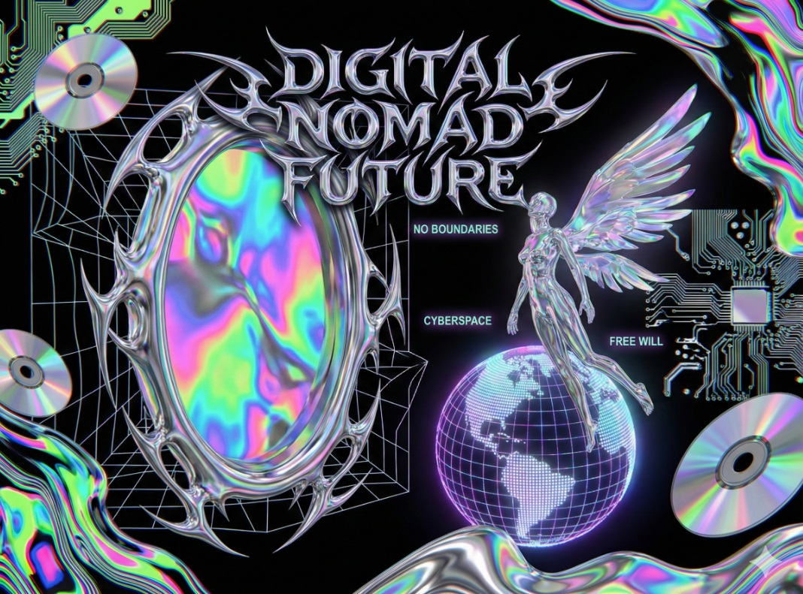 |

---

## Prompt Architecture (V2.1 Template)

Each Gem follows a battle-tested structure:

```
【Role Definition】    → Expert persona & style specialization
【Workflow】
  └─ Step 0: Aspect Ratio & Layout Strategy
  └─ Step 1: Text Deconstruction
  └─ Step 2: Image Generation (Exact Formula)
【Design Rules】       → Style constraints, color palette, texture rules
【Interaction】        → User-facing greeting
```

This ensures **consistent, predictable output** across all 14 styles.

---

## Contributing

Contributions welcome! If you have improvements:

1. Fork the repo
2. Create a feature branch (`git checkout -b feature/new-style`)
3. Commit changes (`git commit -m 'Add new visual style'`)
4. Push and open a Pull Request

Please follow the V2.1 template structure for new prompts.

---

## License

MIT License — see [LICENSE](LICENSE) for details.

---

## Contact / Follow Us

**Scan the QR code to follow us for more AI productivity hacks!**


---

**Made with ❤️ for the Gemini community**
