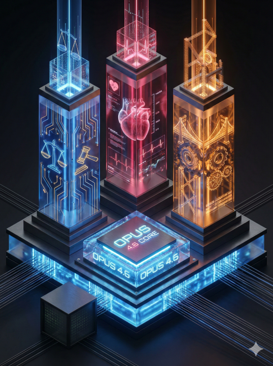

# 💎 Awesome Gemini Visual Gems

[](https://opensource.org/licenses/MIT)
[](https://gemini.google.com)
[](prompts/)
[](README.md)

> **15款实战验证的 Google Gemini 视觉设计提示词** —— 将任意文本精准转化为让人忍不住多看两眼的病毒式视觉图。

---

## 这是什么？

**Gemini Gems** 是可以配置在 Google Gemini 中的自定义指令，将 AI 转化为特定领域的专家。本仓库提供 **15款精心设计的 Gem 指令**，专门用于将任意文本内容转化为高质量、易传播的视觉 Infographic。

这些提示词特别针对具有强大**文字渲染**和**指令遵循**能力的 Gemini 模型（如最新迭代版本）进行了优化。每条提示词都遵循严格的 V2.1 模板结构，确保：

- **智能宽高比适配** — 自动适配封面图 (16:9)、内嵌图 (4:3/1:1)、海报 (3:4) 的布局策略
- **文本解构协议** — 提取主标题，将内容压缩为视觉友好的短语
- **风格专属设计规则** — 强制执行色彩约束、纹理要求、美学底线
- **高保真文字渲染** — 让 AI 图片中的文字清晰可读，告别乱码

---

## 💡 为什么需要这个项目？

**痛点：** 默认的 AI 图片生成器在文字渲染上表现糟糕，经常忽略布局约束，产出的风格也不稳定、过于泛泛。

**解决方案：** 通过将 Google Gemini 强大的文字渲染能力与我们精心设计的提示词架构相结合，这些 Gems 扮演了"翻译层"的角色。它们将你随意的文本转化为严格约束的提示词公式，强制 AI 生成完美的排版和像素级精准的美学效果。

---

## 目录结构

```text
📦 Awesome-Gemini-Visual-Gems
 ┣ 📂 prompts/           # 15 Gem instruction files (.md)
 ┣ 📂 assets/            # Demo images & QR code
 ┣ 📜 README.md          # English documentation
 ┗ 📜 README_cn.md       # 中文说明文档
```

---

## 如何使用

### 第一步：打开 Gemini
访问 [Google Gemini](https://gemini.google.com) 并登录。

### 第二步：创建 Gem
1. 点击侧边栏的 **"Gems"**
2. 点击 **"Create new Gem"**
3. 命名（如 `"马克笔视觉笔记专家"`）

### 第三步：注入提示词
1. 从 `prompts/` 文件夹中打开你选择的 `.md` 文件
2. **复制全部内容**（全选 → 复制）
3. 粘贴到 **"Instructions"** 字段
4. 保存 Gem

### 第四步：开始生成
与你新创建的 Gem 聊天。发送任意文本内容，指定你想要的宽高比，然后坐等魔法发生。

---

## 快速演示

**🧑‍💻 用户输入：**
> "解释第一性原理思维。"

**💎 Gem 处理中：**
*解构概念 ➔ 提取标题"第一性原理" ➔ 匹配视觉隐喻（灯泡、积木块） ➔ 生成精确的渲染公式。*

**✨ 最终发送给图像模型的提示词：**
> *"A highly detailed digital illustration of a vintage chalkboard infographic, academic blackboard art style. Dark dusty slate green background... High-fidelity chalk lettering reading exactly 'First Principles Thinking'..."*

*👇 下方粉笔黑板报的样例图片展示了实际输出效果！*

---

## 15款视觉风格

| 视觉风格 (Gem Name) | 适用场景 | 样例图片 |
|:--|:--|:--:|
| 🖍️ [**01. 马克笔视觉笔记**](prompts/01_Marker_Sketchnote.md) | 知识点降维、读书笔记、轻松的技术科普 |  |
| 🧮 [**02. 粉笔黑板报**](prompts/02_Chalkboard_Academic.md) | 硬核底层逻辑拆解、数理化科普、学术教程 |  |
| 🧍‍♂️ [**03. 极简火柴人**](prompts/03_Minimalist_Stick_Figure.md) | 职场吐槽、哲学思考、幽默的人性观察 |  |
| 🏢 [**04. 扁平商业矢量**](prompts/04_Flat_Vector.md) | B端企业服务、SaaS功能介绍、互联网黑话 |  |
| 🍱 [**05. 苹果风便当盒排版**](prompts/05_Bento_Box_UI.md) | 消费电子产品参数、发布会核心亮点总结 |  |
| 🔮 [**06. 毛玻璃与流体抽象**](prompts/06_Glassmorphism_Abstract.md) | AI大模型概念、Web3前沿趋势、未来感UI |  |
| 🏗️ [**07. 2.5D等距视角**](prompts/07_Isometric_3D.md) | 系统后端架构、云计算网络、供应链流程 |  |
| 📐 [**08. 工程蓝图**](prompts/08_Tech_Blueprint.md) | 硬件拆解评测、机械结构解析、工业制造 |  |
| 📟 [**09. 赛博朋克数据面板**](prompts/09_Cyberpunk_Dashboard.md) | 网络安全报告、黑客技术、暗网数据可视化 |  |
| 🧸 [**10. 3D黏土膨胀风**](prompts/10_3D_Claymorphism.md) | 心理学治愈干货、宠物社群规则、用户增长 |  |
| 👾 [**11. 像素体素复古风**](prompts/11_Pixel_Voxel_Art.md) | 程序员自嘲、复古游戏回顾、极客里程碑 |  |
| ⬛ [**12. 新粗野主义**](prompts/12_Neo_Brutalism.md) | 犀利观点输出、打破常规的设计、潮流先锋 |  |
| 💥 [**13. 复古波普美漫风**](prompts/13_Retro_Pop_Art.md) | 传统与现代的戏剧性冲突、夸张的痛点引入 |  |
| 💿 [**14. 酸性金属流体**](prompts/14_Acid_Graphics_Y2K.md) | 地下电音文化、数字游民生活方式、艺术展 |  |
| 🔮 [**15. 酸性科技几何**](prompts/15_Acid_Tech_Geometry.md) | AI架构可视化、SaaS流程图解、数据安全、抽象科技概念具象化 |  |

---

## 提示词架构 (V2.1 模板)

每款 Gem 都遵循经过实战验证的结构：

```
【Role Definition】    → 专家角色定义与风格专精
【Workflow】
  └─ Step 0: Aspect Ratio & Layout Strategy (宽高比与布局策略)
  └─ Step 1: Text Deconstruction (文本解构)
  └─ Step 2: Image Generation (图片生成精确公式)
【Design Rules】       → 风格约束、色彩方案、纹理规则
【Interaction】        → 用户交互开场白
```

这确保了 15 种风格都能输出**一致、可预测**的高质量结果。

---

## 贡献指南

欢迎贡献！如果你有改进建议：

1. Fork 本仓库
2. 创建功能分支 (`git checkout -b feature/new-style`)
3. 提交更改 (`git commit -m 'Add new visual style'`)
4. 推送并提交 Pull Request

新提示词请遵循 V2.1 模板结构。

---

## 许可证

MIT License — 详见 [LICENSE](LICENSE)。

---

## 联系 / 关注我们

**欢迎大家扫码关注公众号，获取更多 AI 生产力干货！**


---

**为 Gemini 社区用 ❤️ 制作**
